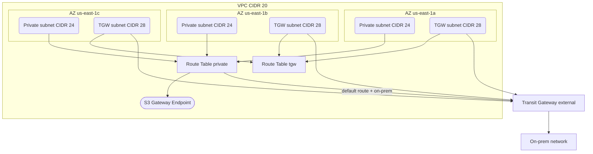

# kefe-terraform-aws-vpc

Terraform module to provision VPC networking for EFE AWS accounts.

## RESUMEN

Reusable VPC module following EFE PRD architecture: private subnets + TGW subnets, no public subnets, no IGW, no NAT. All traffic exits via Transit Gateway.

## OVERVIEW



## Usage

```hcl
module "vpc" {
  source = "../../"

  prefix      = "kefe"
  project     = "data"
  environment = "dev"
  vpc_cidr    = "10.91.0.0/20"

  azs                = ["us-east-1a", "us-east-1b", "us-east-1c"]
  transit_gateway_id = "tgw-0d8bbe277bfa6c109"
}
```

## Migration pilot to production

1. Change `prefix` from `kefe` to `efe` in tfvars
2. Update backend.hcl to point to EFE GHE state bucket
3. Update OIDC provider in workflows to EFE GHE
4. `terraform plan` shows tag renames only, zero destroy

## CONTEXT

- Based on real PRD VPC (505181271348): 10.90.0.0/20, 2 AZs, 4 subnets, no public, no NAT, all TGW
- Improved: 3 AZs (vs 2 in PRD) for higher resilience
- Conditional TGW: if transit_gateway_id is empty, TGW routes are skipped (useful for testing in accounts without TGW)
