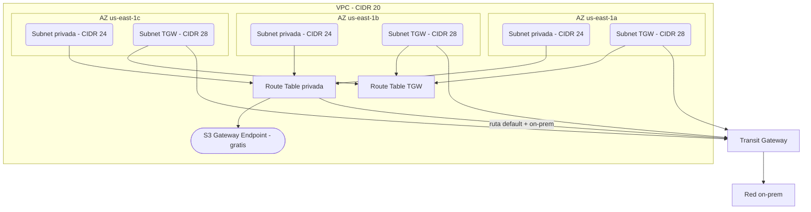

# kefe-terraform-aws-vpc

Modulo Terraform para crear VPCs en cuentas AWS de EFE.

## RESUMEN

Modulo reutilizable que sigue la arquitectura de la VPC de PRD de EFE: subnets privadas + subnets TGW, sin subnets publicas, sin IGW, sin NAT. Todo el trafico sale por Transit Gateway.

## OVERVIEW

## QUE CREA

Por cada cuenta AWS, el pipeline crea:

| Recurso | Cantidad | Descripcion |
|---------|----------|-------------|
| VPC | 1 | Red virtual aislada con CIDR /20 |
| Subnets privadas | 3 | Una por AZ. Aqui van los workloads (Glue, Qlik, CREA, Netezza). |
| Subnets TGW | 3 | Exclusivas para el attachment de Transit Gateway. |
| Route table privada | 1 | Compartida por las 3 subnets privadas. Rutas: default via TGW + on-prem. |
| Route table TGW | 1 | Compartida por las 3 subnets TGW. Solo ruta local. |
| S3 Gateway Endpoint | 1 | Acceso directo a S3 sin salir de la VPC (gratis). |

**NO se crea:** Internet Gateway, NAT Gateway, subnets publicas.

## COMO EJECUTAR

Todo se ejecuta desde la interfaz web de GitHub Actions. No necesitas instalar nada.

1. Ir a la pestana **Actions** de este repositorio
2. Click en **Terraform VPC** (panel izquierdo)
3. Click en **Run workflow**
4. Seleccionar la cuenta (environment) y la accion (plan, apply, destroy)
5. Click en **Run workflow** (boton verde)
6. Si la accion es apply o destroy, un administrador debe aprobar antes de ejecutar

## ENVIRONMENTS

### Simulacion (cuentas sandbox)

| Environment | Cuenta | CIDR VPC |
|-------------|--------|----------|
| kdataops | 882705246437 | 10.200.0.0/20 |
| kdatadev | 339713002785 | 10.201.0.0/20 |
| kdataqa | 471112840515 | 10.202.0.0/20 |

### Cuentas EFE reales (CIDRs pendientes)

| Environment | Cuenta | CIDR VPC |
|-------------|--------|----------|
| efe-dataops | 585853725481 | Pendiente |
| efe-datadev | 518283888505 | Pendiente |
| efe-dataqa | 300601069590 | Pendiente |

## CONTEXT

- Basado en la VPC real de PRD (505181271348): 10.90.0.0/20, 2 AZs, 4 subnets, sin publicas, sin NAT, todo via TGW
- Mejora: 3 AZs (vs 2 en PRD) para mayor resiliencia
- TGW condicional: si transit_gateway_id esta vacio, las rutas TGW se omiten (util para pruebas en cuentas sin TGW)
